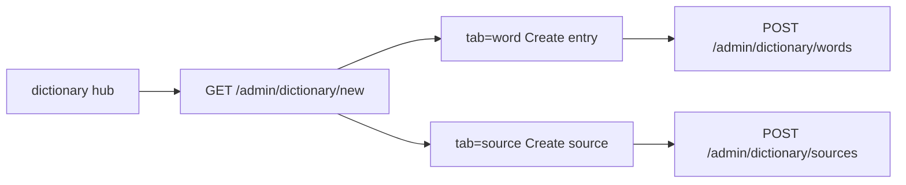

# v1.4.0 service tests, admin source tab, public Hán Việt etymology

## Current gaps (codebase)

| Area | Today |
|---|---|
| Public dictionary | [`/dictionary`](app/routes/dictionary.py) search + JSON typeahead only; **no word detail page**; results in [`dictionarySearch.js`](app/static/js/dictionarySearch.js) are not links |
| Hán Việt public UI | Admin-only; [`HanVietRepository`](app/models/repositories/han_viet_repository.py) has CRUD/aggregates but **no** `get_root_with_compounds` / `get_all_roots_summary` |
| Admin create | [`dictionary_create.html`](app/templates/admin/dictionary_create.html) embeds **New source** inline; POST stays on [`/admin/dictionary/sources`](app/routes/dictionary.py) |
| Service tests | Monolithic [`test_dictionary_services.py`](tests/integration/services/test_dictionary_services.py); [`test_email_service.py`](tests/unit/services/test_email_service.py) / [`test_article_sync_service.py`](tests/unit/services/test_article_sync_service.py) not in per-service dirs; **no** `auth_service` or `image_validation_service` dirs; `han_viet_service` only has [`test_split_syllables.py`](tests/unit/services/han_viet_service/test_split_syllables.py) |

---

## Design decisions (recommended adjustments)

1. **Etymology badge order** — `selectinload(DictionaryWord.han_viet_roots)` order is undefined. [`WordService`](app/services/word_service.py) should expose ordered components by walking [`split_syllables`](app/services/han_viet_service.py) on `viet_word` and matching each syllable to an associated root (skip syllables with no link). This matches learner-facing “Chính + Trị” breakdowns.

2. **Public routes stay SSR** — No new public JSON API. Controllers render templates; existing admin JSON routes unchanged.

3. **Stable word URLs** — Use `GET /dictionary/<int:word_id>` for the public detail page (simple, matches IDs in search JSON). Link search results and explorer compound cards to this route.

4. **Root URLs** — `GET /han-viet/<path:root_syllable>` with lookup on **normalized lowercase** `han_viet_roots.root` (consistent with [`create_and_associate`](app/services/han_viet_service.py)). Index supports optional `?q=` prefix filter on root text; default sort by compound count descending.

5. **404 semantics** — Unknown `word_id` or root syllable → 404 HTML (reuse existing site error handling pattern).

6. **Association cascade** — Word delete already drops `word_han_viet_association` rows only ([`test_word_service_delete_cascades_associations`](tests/integration/services/test_dictionary_services.py), table tests). No schema change; add/keep integration coverage after test file split.

7. **Admin source tab** — Keep **one** admin entry route `GET /admin/dictionary/new?tab=word|source` (default `word`), reusing dashboard-style tab links in [`admin.css`](app/static/css/admin.css). Remove inline “New source” from the word tab; source tab posts to existing `POST /admin/dictionary/sources`. Hub “Add New Word” unchanged; source tab reachable from tab strip on the create workspace (optional: add “Create source” link on hub pointing to `?tab=source`).

8. **Controller split** — Add [`app/controllers/han_viet_controller.py`](app/controllers/han_viet_controller.py) for public explorer (keeps [`dictionary_controller.py`](app/controllers/dictionary_controller.py) from growing further). Register public routes on existing [`dictionary_bp`](app/routes/dictionary.py).

---

## 1. Per-function service test layout

Follow existing conventions: module docstring, `Verifies that...` docstrings, `@pytest.mark.dictionary` where applicable, parametrize matrices, `.venv` pytest.

### Dictionary integration (migrate monolith)

Delete [`tests/integration/services/test_dictionary_services.py`](tests/integration/services/test_dictionary_services.py) after moving cases into:

**`tests/integration/services/word_service/`** — one file per method: `test_search_prefix.py`, `test_check_duplicate.py`, `test_get_entry.py`, `test_create_entry.py`, `test_update_entry.py`, `test_delete_entry.py`, `test_add_example.py`, `test_remove_example.py` (carry over existing scenarios; add minimal happy-path where today only validation is covered).

**`tests/integration/services/source_service/`** — `test_list_recent.py`, `test_search.py`, `test_create.py`, `test_delete.py`.

**`tests/integration/services/han_viet_service/`** — `test_check_existing_roots.py`, `test_associate_root.py`, `test_create_and_associate.py`, `test_unlink_root.py`, `test_delete_root.py` (plus existing unit `split_syllables`).

Add **`tests/integration/services/han_viet_service/test_get_root_cluster.py`** and **`test_get_explorer_index.py`** after new service methods land (Feature B).

Add **`tests/integration/services/word_service/test_get_public_entry.py`** (or `test_ordered_etymology_components.py`) for ordered etymology helper once implemented.

### Auth (1.4.0-related, unit + app context)

**`tests/unit/services/auth_service/`** — `test_hash_password.py`, `test_authenticate_admin.py`, `test_logout_admin.py`, `test_is_admin_authenticated.py`, `test_current_admin_username.py` using existing `app` / `client` / `session` fixtures.

### Remaining single-file services (move into dirs, no behavior change)

| From | To |
|---|---|
| [`test_email_service.py`](tests/unit/services/test_email_service.py) | `tests/unit/services/email_service/test_send_contact_email.py` |
| [`test_article_sync_service.py`](tests/unit/services/test_article_sync_service.py) | `tests/unit/services/article_sync_service/test_find_missing_articles.py` |
| (new) | `tests/unit/services/image_validation_service/test_is_valid_image_path.py` |

### Blog gaps (same per-function rule)

Add missing integration files under [`tests/integration/services/blog_service/`](tests/integration/services/blog_service/): `test_get_blog_posts_by_category.py`, `test_get_related_blog_posts.py`, `test_get_all_categories_with_counts.py`.

**Out of scope for file moves:** `blog_service`, `google_drive_service`, etc. already follow the directory pattern; only add missing function files and dictionary/auth migrations above.

---

## 2. Admin create workspace: source tab

- **Controller** — extend `render_create_workspace(tab=...)` to render tabbed template; add `render_create_source_tab` context (source types enum only).
- **Templates** — refactor to shared tab shell (e.g. [`dictionary_create_workspace.html`](app/templates/admin/dictionary_create.html) with `` / `source` panels) or include partials; remove lines 61–76 (New source section) from word panel.
- **JS** — [`dictionaryAdmin.js`](app/static/js/dictionaryAdmin.js): gate `create-source` handler to source tab only (or small `dictionaryAdminSource.js` loaded on source tab); word tab keeps example source **select** fed by `recent_sources` JSON.
- **Tests** — extend admin route smoke: `GET /admin/dictionary/new?tab=source` 200, word tab does not contain “New source” heading; source tab contains create form; auth still required.

---

## 3. Feature A: Public word detail + etymology badges

### Repository / service

- Confirm [`WordRepository.get_by_id(..., with_relations=True)`](app/models/repositories/word_repository.py) loads `han_viet_roots` (already via `selectinload`).
- **WordService** — add `get_public_entry(word_id)` returning the hydrated `DictionaryWord` plus `ordered_etymology: list[dict]` (`root`, `chinese_character`, `root_meaning`) using syllable-order rule above; reuse `get_entry` internally.

### Routes / controller / template

- `GET /dictionary/<int:word_id>` → `dictionary_controller.render_word_detail_page(word_id)` → [`app/templates/dictionary/word_detail.html`](app/templates/dictionary/word_detail.html) (new).
- Show: Vietnamese headword, English gloss, word types, examples (sentence + translation + source title when present), and **Etymology / Breakdown** section when `ordered_etymology` non-empty.
- Badge pattern: `Chính` [正 — *main*] + `Trị` [治 — *govern*]; each root links to `url_for('dictionary.han_viet_root_detail', root_syllable=...)`.
- **CSS** — extend [`dictionary.css`](app/static/css/dictionary.css) (etymology badges, detail layout).
- **Search UX** — wrap result term in `<a href="/dictionary/{id}">` in [`dictionarySearch.js`](app/static/js/dictionarySearch.js); keep admin Edit link.

---

## 4. Feature B: Hán Việt root explorer

### Repository ([`HanVietRepository`](app/models/repositories/han_viet_repository.py))

- `get_root_with_compounds(root_syllable: str)` — single root row + joined `dictionary_words` (viet_word, english_translation, word id) via `word_han_viet_association`; return `None` if root missing.
- `get_all_roots_summary(title_query: str = "", limit: int = ...)` — all roots with `compound_count` (distinct words), ordered by count desc then root asc; optional `LIKE` on root for index search.

### Service ([`HanVietService`](app/services/han_viet_service.py))

- `get_explorer_index(q: str = "")` — wraps summary list for index template.
- `get_root_cluster(root_syllable: str)` — wraps root + compounds; raise or return optional for controller 404.

### Routes / templates / CSS

- `GET /han-viet` → index [`han_viet_explorer.html`](app/templates/dictionary/han_viet_explorer.html): search form (`q`), grid/list of roots with count badges, link to detail.
- `GET /han-viet/<path:root_syllable>` → detail [`han_viet_detail.html`](app/templates/dictionary/han_viet_detail.html): large character + syllable + meaning; cluster/grid of compound cards linking to `/dictionary/<word_id>`.
- Add `han-viet` entry to [`css_loader.html`](app/templates/macros/css_loader.html) bundle map → new [`han_viet.css`](app/static/css/han_viet.css) (reuse privacy/admin card language where sensible).

---

## 5. Verification & tests (new behavior)

| Layer | Files |
|---|---|
| Unit | `tests/unit/services/han_viet_service/test_get_root_cluster.py`, `test_get_explorer_index.py`; `tests/unit/services/word_service/test_ordered_etymology.py` (pure ordering with mocked roots) |
| Repository integration | `tests/integration/models/repositories/test_han_viet_public_queries.py` — joins, summary counts, empty query |
| Route/controller | `tests/integration/routes/dictionary/test_public_word_detail.py`, `test_public_han_viet_routes.py` — 200 without auth; 404 unknown id/root |
| Regression | Word delete + association cleanup (from migrated `word_service` delete test) |

Run targeted `.venv` pytest for all new/moved paths; serial DB tests if needed (existing MySQL DDL quirk).

---

## 6. Changelog and commit draft (still [1.4.0])

Update existing [`CHANGELOG.md`](CHANGELOG.md) `[1.4.0]`:

- **Added** — public word detail etymology badges; `/han-viet` explorer index and root cluster pages; admin create workspace source tab.
- **Changed** — service test layout (per-function directories for remaining services).
- **Testing** — bullet listing new public route and HanViet/Word service coverage.

Create **new** draft (do not replace UI/auth draft unless you prefer one combined message): [`temporary/commit-drafts/v1.4.0-etymology-service-tests.txt`](temporary/commit-drafts/v1.4.0-etymology-service-tests.txt). Do not commit.

---

## Implementation order

1. Repository methods + HanViet/Word service methods (Feature A/B core)
2. Public routes, templates, CSS, search links
3. Admin tabbed create workspace + JS split
4. Migrate/add all service test directories; delete monolithic files
5. Changelog + new commit draft
6. Run pytest via `.venv`
