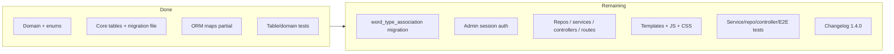
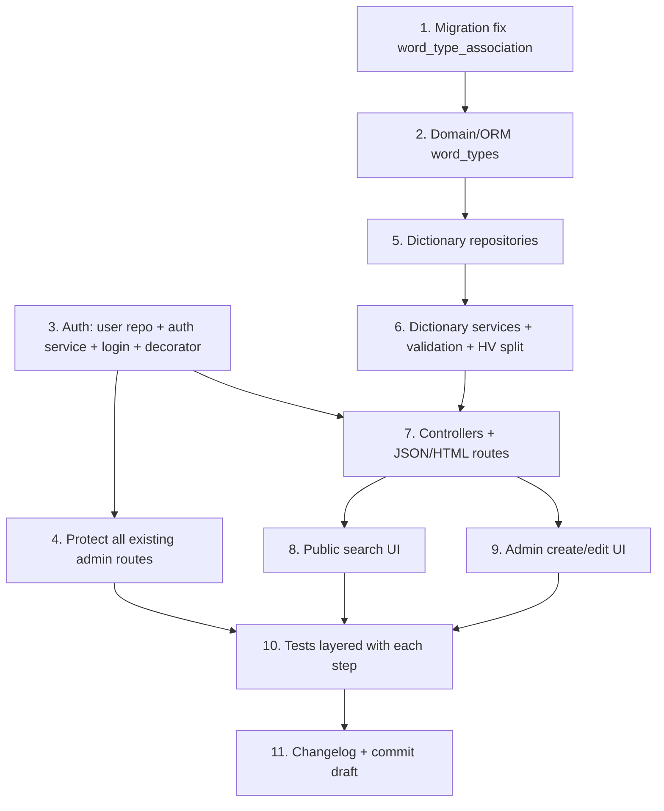

# v1.4.0 Remaining Implementation Plan

## Current state summary

v1.4.0 is **schema/domain-complete** with strong table/domain tests. The **application stack, admin auth, and UI are essentially unimplemented**. `__version__` is already `1.4.0`; [CHANGELOG.md](CHANGELOG.md) still ends at `1.3.0`.

---

## 1. Requirements / design → current implementation map

| Area | PRD / TDD | Status |
|---|---|---|
| `users`, `dictionary_*`, `han_viet_roots`, association tables | Schema §3 | **Mostly complete** (see migration drift) |
| Domain POCOs + `SourceType` / `WordType` | Domain layer | **Mostly complete**; `DictionaryWord` lacks `word_types` |
| ORM imperative maps | Architecture | **Partial**: no `word_type_association` mapping |
| Admin login + `session["is_admin"]` + `@admin_required` | PRD §2 | **Missing** |
| Word / HV / source / example repositories | TDD flows | **Missing** |
| Word / HV / source services + validation | TDD §2–3 | **Missing** |
| Dictionary controllers + routes | US1.4.1–1.4.3 | **Missing** |
| Public search UI (200ms debounce) + admin Edit | US1.4.1 | **Missing** |
| Create/edit workspaces, duplicate 400ms, HV UI, delete confirm | US1.4.2–1.4.3 | **Missing** |
| Admin theme vars | PRD §3 | **Missing** |
| Changelog `[1.4.0]` | Delivery rules | **Missing** |

---

## 2. Treat as complete (do not recreate)

- Domain: [app/domain/dictionary_word.py](app/domain/dictionary_word.py), [dictionary_example.py](app/domain/dictionary_example.py), [dictionary_source.py](app/domain/dictionary_source.py), [han_viet_root.py](app/domain/han_viet_root.py), [user.py](app/domain/user.py), [domain_enums.py](app/domain/domain_enums.py)
- Tables: all seven design tables under [app/models/tables/](app/models/tables/) including indexes and CASCADE FKs
- Migration content in [migrations/versions/fa9b2e01010f_add_dictionary_tables_and_remove_logs.py](migrations/versions/fa9b2e01010f_add_dictionary_tables_and_remove_logs.py) (except live-DB drift for `word_type_association`)
- ORM maps for User, DictionaryWord (examples + roots), DictionaryExample, DictionarySource, HanVietRoot in [app/orm.py](app/orm.py)
- Fixtures: [tests/fixtures/dictionary_data_fixtures.py](tests/fixtures/dictionary_data_fixtures.py)
- Unit domain tests + integration table tests under `tests/unit/domain/` and `tests/integration/models/tables/` covering uniqueness, prefix `LIKE`, example/source/word-type/HV cascades, composite PK duplicates
- “No public registration” (satisfied by absence)
- Existing site theme vars in [app/static/css/variables.css](app/static/css/variables.css) (reuse; extend for admin semantics)

---

## 3. Partially implemented — what remains

### A. `word_type_association` migration drift (**conflict**)

- Table is defined in code and in revision `fa9b2e01010f` (added in commit `0f04b8e` after that revision was already stamped).
- Live DBs already at head **will not create** the table on `flask db upgrade`.
- Fresh test DBs that migrate from scratch **do** get it.
- **Fix:** add a **new** Alembic revision that creates `word_type_association` if missing (idempotent/`IF NOT EXISTS` or inspector check). Do **not** rewrite the already-applied revision.

### B. Domain / ORM word types

- [DictionaryWord](app/domain/dictionary_word.py) has `examples` / `han_viet_roots` but **no `word_types`**.
- [app/orm.py](app/orm.py) does not map `word_type_association`.
- **Remain:** add `word_types: List[WordType | str]` (or equivalent) on the domain aggregate; map association in ORM (collection of strings or association proxy pattern consistent with existing imperative style).

### C. `DictionaryExample.updated_at`

- Table has `updated_at`; domain only exposes `created_at`. Low priority; hydrate when repositories return full rows.

### D. Existing blog admin routes

- [app/routes/admin.py](app/routes/admin.py) is unprotected; controller docstrings claim auth.
- **Decision (confirmed):** protect **all** existing `/admin/*` routes with `@admin_required`.

---

## 4. Not yet implemented — files/modules to create or change

### Auth (foundation for all admin work)

| Create / change | Purpose |
|---|---|
| `app/auth/decorators.py` (or `app/utils/admin_required.py`) | `@admin_required`: HTML → redirect `/admin/login`; JSON/mutation → 401/403 |
| `app/models/repositories/user_repository.py` | Lookup by username |
| `app/services/auth_service.py` | Verify password hash; establish/clear session |
| `app/controllers/auth_controller.py` | Login/logout orchestration |
| Extend [app/routes/admin.py](app/routes/admin.py) | `GET/POST /admin/login`, `POST/GET /admin/logout`; wrap all admin routes |
| `app/templates/admin/login.html` | Login page (not in public nav) |
| [app/config.py](app/config.py) | Session cookie security as needed; leave unused Google OAuth keys for now (called out below) |
| Password hashing | Use Werkzeug `generate_password_hash` / `check_password_hash` (already via Flask); seed/admin bootstrap mechanism as needed |

### Dictionary persistence & business layers

Follow existing Routes → Controller → Service → Repository. Prefer real DB via `session` fixtures like blog/dictionary table tests. For aggregates with mapped relationships, repositories may use the Session + mapped domain objects already registered in `orm.py`, while keeping SQL-style lookups where they match [BlogPostRepository](app/models/repositories/blog_post_repository.py) patterns.

| Create | Key responsibilities |
|---|---|
| `word_repository.py` | Prefix search (`idx_viet_word_prefix`); exact duplicate by `viet_word`; get-by-id with relationships; create/update/delete; word-type assoc CRUD |
| `han_viet_repository.py` | Batch root lookup by syllables; create root; delete root; create/delete association; count associations |
| `source_repository.py` | Search/list; recent by `created_at` DESC; create; delete |
| `example_repository.py` (or methods on word repo) | Create/delete examples |
| `word_service.py` | Validation; duplicate check; create/update/delete entry; coordinate types/examples |
| `han_viet_service.py` | Syllable split (lowercase, preserve diacritics); found vs missing; associate; create+associate; unlink; **deletion safety** |
| `source_service.py` | Title required; create/delete |
| Dictionary exceptions in [app/exceptions.py](app/exceptions.py) | Validation / not-found / conflict / root-in-use |
| Optional `app/models/data_schemas/*` | Only if controllers need Marshmallow serialization like blog; otherwise keep thin JSON dicts |

**Word validation (confirmed):** after trim, non-empty; only Vietnamese letters (Latin + Vietnamese diacritics), spaces, and hyphen. Reject digits and other punctuation.

### Controllers & routes

| Create | Endpoints (illustrative; follow existing kebab-case `/admin/...` style) |
|---|---|
| `dictionary_controller.py` + `routes/dictionary.py` | Public: search/autocomplete; admin create/edit page renders |
| Admin mutation routes (dictionary blueprint or admin bp) | Duplicate check; create/update/delete word; examples; sources; HV check/associate/create/unlink/delete |

Thin routes extract request data and pass explicit params; controllers never touch `request`.

### Frontend

| Create | Behavior |
|---|---|
| Public dictionary page + nav link in [base.html](app/templates/base.html) | Typeahead with **200ms** debounce; admin sees Edit when `session["is_admin"]` |
| Admin create workspace template + JS | **400ms** duplicate check; types add/remove; examples + sources (recent + create); HV check/associate/create; optional roots |
| Admin edit workspace | Update fields; manage examples/roots; unlink vs delete root; word delete with **secondary confirmation** |
| CSS | Add admin semantic vars (`#1e293b`, `#94a3b8`, `#ef4444`) without duplicating existing site accents |
| Static JS modules | Debounce helpers, fetch wrappers for JSON endpoints |

Default public URL: **`/dictionary`** (not specified in PRD; called out in §8).

### Delivery artifacts

- Add `## [1.4.0]` (or Unreleased) entry to [CHANGELOG.md](CHANGELOG.md)
- Draft commit message under `temporary/commit-drafts/` when implementation completes (per delivery rules; no git commit unless asked)

---

## 5. Database migrations required

1. **New migration:** create `word_type_association` when absent (fix drift for DBs already stamped at `fa9b2e01010f`).
2. No other schema deltas vs TDD table definitions.
3. After adding the migration: run `flask db upgrade` before verification tests (delivery rule).
4. Do **not** edit `fa9b2e01010f` further.

---

## 6. Tests

### Already covering implemented behavior

- Domain constructors: `tests/unit/domain/test_*` (word, example, source, root, user)
- Table constraints/cascades: `tests/integration/models/tables/test_*`
- Fixtures/conftest patterns to reuse: `session`, `make_word` / `make_root` / `make_source` / `bind_*` / `seed_dictionary`

### Still needed

| Layer | Coverage |
|---|---|
| Unit | Syllable splitter preserves accents; word character-rule validation; root deletion-safety decision logic |
| Integration / repository | Prefix search, duplicate lookup, HV batch lookup via **real repositories** |
| Integration / service | Blank/invalid word rejected; source without title rejected; root delete rejected when associated; unlink preserves root; create root + associate; entry delete cascades through service/repo |
| Controller | Direct controller calls (blog pattern) for duplicate-check, CRUD, HV flows, auth redirect/reject behavior |
| Route / decorator | `@admin_required` on blog + dictionary admin routes; login/logout session |
| E2E | **Use existing Selenium** (not Playwright): admin login → Edit visible; create form + duplicate feedback; HV detect/associate/create |

**Note:** Existing table test that deletes a root and asserts association cascade is **DB cascade behavior**, not TDD “deletion safety”. Keep it; add separate service tests for the business rule.

---

## 7. Conflicts with requirements / design

1. **`word_type_association` migration drift** — code/tests expect table; stamped DBs may lack it. New migration required.
2. **Auth model vs leftovers** — PRD requires session `is_admin` + password hash; [config.py](app/config.py) still has unused Google OAuth admin settings; README/architecture diagrams still mention OAuth; unused `Flask-Login` in requirements. Implement session auth as specified; do not implement OAuth for v1.4.0. Flag OAuth config/docs as stale (cleanup can be minimal: stop treating OAuth as required for admin).
3. **Blog admin claimed-authenticated but unprotected** — resolved by protecting all `/admin/*`.
4. **`HanVietRoot` ID constraints** — TDD Unit Target A mentions zero/negative IDs “handled according to the domain specification”; current domain accepts them and tests assert passthrough. **No domain ID rejection in current code.** Treat as non-blocking unless you want domain validation added later; do not change existing tests silently.
5. **Version vs changelog** — `__version__ == 1.4.0` without changelog entry.
6. **E2E tool** — TDD says Playwright “may” be used; project has Selenium only. Plan uses Selenium to avoid new test infrastructure.

---

## 8. Ambiguities / questionable items (defaults applied)

| Item | Decision for this plan |
|---|---|
| Allowed character rules | **Confirmed:** Vietnamese letters + spaces + hyphen; non-blank after trim |
| Protect blog admin | **Confirmed:** all `/admin/*` |
| Public dictionary URL / nav | Default **`/dictionary`** + main nav link |
| “Recently used” sources | Order by `created_at` DESC (no separate usage table) |
| Word types required on create? | Allow **zero** types (PRD says can add/remove; does not require ≥1) |
| Mutation rejection status | **401** for unauthenticated JSON/AJAX; redirect for browser HTML GETs |
| Password hashing | Werkzeug hashes; fixtures’ `$2b$` bcrypt samples may need alignment when auth verify is implemented (use Werkzeug consistently for new hashes) |
| Duplicate match | Exact `viet_word` via DB unique + `utf8mb4_unicode_ci` (case-insensitive) |
| `data_schemas` for dictionary | Add only if serialization convenience matches blog; not required by TDD |
| Playwright vs Selenium | **Selenium** |
| Whether Flask-Login should be used | **No** — custom `session["is_admin"]` per PRD |
| Admin user bootstrap | Need a documented way to insert the first admin (CLI/script or migration seed). Default: small management command or documented one-off insert using Werkzeug hash — **not** public registration |

---

## 9. Ordered implementation steps and dependencies

1. **Migration** — new revision for `word_type_association`; `flask db upgrade`; confirm table tests still pass.
2. **Domain/ORM** — `word_types` on `DictionaryWord` + ORM secondary/collection mapping; update domain unit tests lightly.
3. **Auth stack** — user repository, hashing/verify, login/logout, `@admin_required`, login template; unit/controller tests for session and decorator.
4. **Protect blog admin** — apply decorator to all existing routes in [admin.py](app/routes/admin.py); update admin route/controller tests to authenticate (or expect redirect/401).
5. **Repositories** — word, HV, source, example; repository integration tests (prefix, duplicate, batch root, cascades via repo delete).
6. **Services** — validation (word rules + source title), duplicate check, HV syllable split + found/missing, associate/create/unlink, root delete safety, word delete; service tests.
7. **Controllers + routes** — search, duplicate-check, CRUD, examples, sources, HV endpoints, create/edit page renders; controller tests.
8. **Public UI** — `/dictionary` typeahead 200ms; Edit when admin.
9. **Admin UI** — create workspace (400ms duplicate, types, examples/sources, HV); edit workspace (unlink/delete safety messaging, secondary delete confirm); admin CSS vars.
10. **E2E Selenium** — auth journey; create walkthrough; HV automation (as feasible with existing Selenium fixtures).
11. **Changelog `[1.4.0]`** + commit-message draft in `temporary/commit-drafts/`.

**Dependency notes:** Auth (3–4) can proceed in parallel with repos (5) after migration/ORM. UI (8–9) depends on routes (7). Do not block backend tests on UI.

---

## Out of scope / explicit non-goals for this delta

- Milestone 1.5.0 Reader pre-population
- Replacing OAuth docs/diagrams broadly (optional small README note if touched)
- Introducing Playwright
- Rewriting already-correct domain/table tests
- Public user registration
