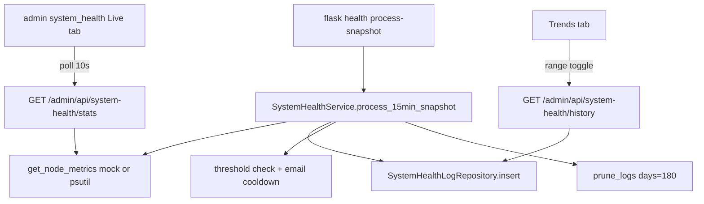

# v1.4.0 System Health, dictionary hero, admin copy

## Design locks (vs request wording)

- **Persistence pattern:** Follow existing Core tables + repository (not a standalone declarative `models/system_health_log.py`). Add [`app/models/tables/system_health_log.py`](app/models/tables/system_health_log.py) + [`SystemHealthLogRepository`](app/models/repositories/) + Alembic migration. Domain can stay as plain dicts/dataclasses returned by the service.
- **Timestamps:** Use timezone-aware UTC (`TIMESTAMP(timezone=True)` / `datetime.now(timezone.utc)`), matching dictionary tables—not naive `datetime.utcnow`.
- **Charts:** Reuse vendored Chart.js at [`app/static/vendor/chartjs/`](app/static/vendor/chartjs/) and the fetch/update pattern from [`dictionaryDashboard.js`](app/static/js/dictionaryDashboard.js). No new chart library.
- **Dev/test isolation:** Mock metrics when `FLASK_ENV` is `development` **or** `testing` (so CI/Windows never call `psutil`). Production uses real `psutil` with `cpu_percent(interval=None)`.
- **CLI shape:** Register Click group `health` so `flask health process-snapshot` works (new module registered from [`app/__init__.py`](app/__init__.py)), matching existing `create-admin` registration style.
- **Alert cooldown:** Persist via boolean `alert_sent` on each snapshot row (or query last row with `alert_sent=True` in the past hour). Avoid process-local memory (cron is short-lived).

---

## 1. Public dictionary hero + admin copy

### Dictionary intro ([`dictionary/index.html`](app/templates/dictionary/index.html) + [`dictionary.css`](app/static/css/dictionary.css))

Restyle `.dictionary-intro` to mirror [`.admin-workspace-intro`](app/static/css/admin.css) visual weight:

- Gradient `linear-gradient(135deg, var(--accent-primary), var(--accent-primary-hover))`
- Padding ~2.5rem, `border-radius: 12px`, soft box-shadow, centered text
- Keep existing intro paragraphs; optional short heading if it improves hierarchy without changing copy meaning
- Brand variables only (accent greens); no new palette

### Admin landing ([`admin/home.html`](app/templates/admin/home.html))

- Keep title `Admin workspace`
- Replace subtitle with:  
  `Choose an area to access. Dictionary tools and system health are available now; blog administration is still being prepared.`
- Add third tile **System Health** → `/admin/system-health` (icon e.g. `bi-heart-pulse`), beside Blog and Dictionary

---

## 2. System Health stack



### A. Table + migration

[`system_health_logs`](app/models/tables/system_health_log.py):

| Column | Type |
|---|---|
| `id` | Integer PK |
| `timestamp` | TIMESTAMP(tz), indexed, server default CURRENT_TIMESTAMP |
| `cpu_percent` | Float |
| `ram_percent` | Float |
| `ram_used_mb` | Float |
| `swap_percent` | Float |
| `disk_percent` | Float |
| `alert_sent` | Boolean, default false |

New Alembic revision under `migrations/versions/`. Apply with `flask db upgrade` before verification (delivery rule).

Repository methods: `insert(...)`, `list_since(cutoff)`, `prune_older_than(days=180)`, `last_alert_sent_at()`.

### B. Service ([`app/services/system_health_service.py`](app/services/system_health_service.py))

1. **`get_node_metrics()`**  
   - Dev/test mock (~1GB Lightsail): fixed-ish realistic values + `uptime`, `os_info`, `environment: "DEV MOCK"`.  
   - Production: `psutil.cpu_percent(interval=None)`, `virtual_memory()`, `swap_memory()`, `disk_usage('/')`, `boot_time()` → formatted uptime; `environment: "PRODUCTION"`.

2. **`get_historical_metrics(range_key)`** — ranges and server-side bucketing so charts stay readable:

| Range | Key | Bucket |
|---|---|---|
| 24 hours | `24h` | raw 15-min points |
| 7 days | `7d` | hourly avg |
| 30 days | `30d` | 6-hour avg |
| 90 days | `90d` | daily avg |
| 180 days | `180d` | daily avg |

   Return Chart.js-ready `{ labels, cpu, ram }` (and swap/disk if useful for secondary series). Reuse MySQL-friendly grouping (`DATE_FORMAT` / hour expressions), same approach as word-velocity buckets.

3. **`process_15min_snapshot()`**  
   - Capture metrics (real on production; on development/testing: either skip DB write + return early, or write mock rows only in testing when explicitly needed—**default: skip snapshot persistence in development** so local Windows cron is a no-op; production always writes).  
   - Thresholds: CPU > 90% OR RAM > 85% OR Disk > 90% → send alert if no `alert_sent` in last hour.  
   - Email via new helper on [`email_service`](app/services/email_service.py) (e.g. `send_system_health_alert(subject, body)` using `MAIL_USERNAME` / `MAIL_RECIPIENT`).  
   - Call `prune_logs(days=180)`.

4. **Dependency:** add `psutil` to [`requirements.txt`](requirements.txt).

### C. Routes / controller / UI

Layering: thin routes on [`admin_bp`](app/routes/admin.py) → [`system_health_controller`](app/controllers/system_health_controller.py) → service.

| Route | Role |
|---|---|
| `GET /admin/system-health` | SSR page, `@admin_required`, tabs via `?tab=live\|trends` |
| `GET /admin/api/system-health/stats` | JSON live metrics, `@admin_required` |
| `GET /admin/api/system-health/history?range=` | JSON series, `@admin_required`, invalid range → 400 |

Template [`app/templates/admin/system_health.html`](app/templates/admin/system_health.html) + [`admin.css`](app/static/css/admin.css) KPI/progress styles:

- **Live:** 4 KPI cards (CPU/RAM/Swap/Disk) with green/yellow/red bars (<70 / 70–85 / >85); uptime + OS banner; `PRODUCTION` / `DEV MOCK` badge; JS poll every 10s.
- **Trends:** Chart.js line charts (CPU + RAM); range toggles `24h|7d|30d|90d|180d` fetching history JSON (mirror velocity toggles).

New JS: [`app/static/js/systemHealth.js`](app/static/js/systemHealth.js) (poll + charts). Load Chart.js vendor only on trends tab or always on this page.

### D. CLI ([`app/cli/health.py`](app/cli/health.py))

```text
flask health process-snapshot
```

Register group in [`create_app`](app/__init__.py). Document cron in new [`docs/system-health.md`](docs/system-health.md) (and a one-line pointer from README if it already has ops notes):

```bash
*/15 * * * * cd /path/to/app && /path/to/venv/bin/flask health process-snapshot > /dev/null 2>&1
```

---

## 3. Tests (per-function layout where it fits)

- **Unit** `tests/unit/services/system_health_service/`: mock `get_node_metrics` in development; threshold/cooldown logic with fakes; invalid history range.
- **Integration** repository insert/list/prune; history bucketing with seeded timestamps.
- **Routes:** unauthenticated → 401/302; authenticated live page 200; stats/history JSON shape; invalid range 400.
- Dictionary CSS/copy smoke not required beyond existing page load if unchanged markup ids.

Run via `.venv`; apply migration before DB tests.

---

## 4. Changelog + commit draft

Extend [`CHANGELOG.md`](CHANGELOG.md) `[1.4.0]`:

- **Added** — System Health admin module (live metrics, historical Chart.js trends, snapshot CLI, alert email); `psutil` dependency; docs for cron.
- **Changed** — dictionary intro hero aligned with admin workspace header; admin landing copy + System Health tile.

New draft only: [`temporary/commit-drafts/v1.4.0-system-health.txt`](temporary/commit-drafts/v1.4.0-system-health.txt). Do not commit.

---

## Ordered steps

1. Table + migration + repository (+ `flask db upgrade`)
2. `SystemHealthService` + email alert helper + `psutil` dependency
3. Controller/routes/template/CSS/JS + admin tile + dictionary hero CSS + admin copy
4. CLI group + docs/system-health.md
5. Tests
6. Changelog `[1.4.0]` + commit-message draft
7. Targeted pytest via `.venv`
