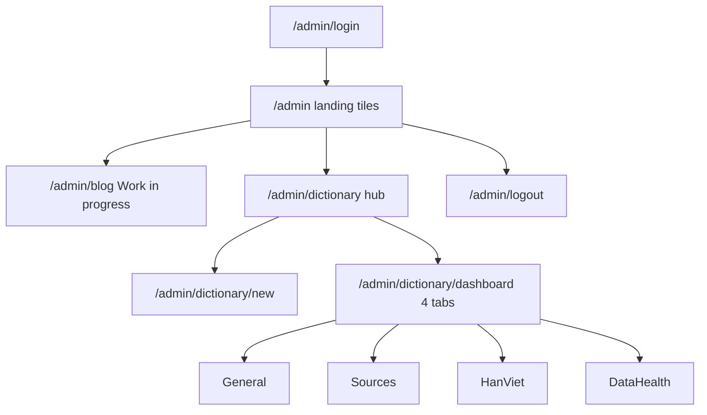

# v1.4.0 UI, Auth Redirect, and Dictionary Dashboard Adjustments

## Findings from current code

### 1. Admin login redirect safety — **not safe today**

[`app/controllers/auth_controller.py`](app/controllers/auth_controller.py) currently does:

```36:38:app/controllers/auth_controller.py
    destination = next_url if next_url and next_url.startswith("/") else url_for(
        "dictionary.render_dictionary_page"
    )
```

This **rejects** bare absolute URLs like `https://attacker.com` (they do not start with `/`), but **accepts protocol-relative URLs** such as `//attacker-phishing-site.com`, which browsers treat as an external redirect. The same unvalidated `next_url` is also used in `show_login_page` when the admin is already authenticated (line 17).

There are **no** automated tests covering malicious `next` values.

### 2–3. Public dictionary copy — template-only

[`app/templates/dictionary/index.html`](app/templates/dictionary/index.html) currently has:

- `<h1>Dictionary</h1>`
- `<p class="subtitle">Type a Vietnamese word or phrase to find matching entries.</p>`
- input `placeholder="Search Vietnamese words..."`

Search behaviour in [`app/static/js/dictionarySearch.js`](app/static/js/dictionarySearch.js) does not depend on this copy.

### 4. Admin workspace — no landing hub yet

Successful login defaults to the **public** dictionary page (`dictionary.render_dictionary_page`). Admin create/logout links are currently embedded on the public dictionary page when `is_admin` is true. Privacy-style tiles already exist in [`app/templates/privacy.html`](app/templates/privacy.html) + [`app/static/css/privacy.css`](app/static/css/privacy.css) (`.privacy-cards` / `.privacy-card` with hover lift).

### 5. Dashboard analytics — **not implemented**

Repositories today only cover CRUD/lookup (`WordRepository`, `SourceRepository`, `HanVietRepository`, `ExampleRepository`). There is **no chart library** in the project; blog pagination patterns exist (`PER_PAGE`, blog list templates). Existing useful indexes for aggregates: `idx_viet_word_prefix`, `idx_sources_type_lookup`, `idx_word_examples_lookup (word_id, created_at)`, unique `han_viet_roots.root`, association PKs.

### Conflicts with v1.4.0 PRD / TDD

| Item | Conflict? |
|---|---|
| Safer `next_url` | None — strengthens auth |
| Public copy / intro | None — content only |
| Admin tile landing | Additive UI; keep US1.4.1 Edit on public search results |
| Default post-login → `/admin` | Compatible with PRD |
| Blog “Work in progress” | Placeholder; existing blog admin JSON routes unchanged |
| Four-tab Dictionary Dashboard | **Additive** beyond original v1.4.0 PRD/TDD (those focused on entry CRUD + search). Fits admin workspace goals; does not replace create/edit flows |

---

## Doubts / interpretation defaults (called out)

These are not blockers; the plan commits to the defaults below. Push back if you want a different interpretation.

1. **Charts: hybrid approach (decision)**  
   - **Categorical summaries** (etymology, word types, leaderboards): keep **custom Privacy-style CSS bars/lists** — no library needed.  
   - **Word velocity time series** (line/area + range toggles): use **Chart.js** (MIT), vendored under `app/static/vendor/chartjs/` like Bootstrap/Font Awesome — **not** a hand-rolled SVG/canvas chart.  
   **Why Chart.js over custom:** axes, tooltips, responsive redraw, and area fills are non-trivial to maintain; Chart.js is small, widely used, and fits a single line/area series. ApexCharts is heavier; uPlot is leaner but poorer DX for simple admin toggles. Avoid CDN-only dependency so offline/tests stay consistent with existing vendor pattern.

2. **“Etymological breakdown (Hán Việt vs Native/Other)”**  
   **Default:** Hán Việt = words with ≥1 `word_han_viet_association` row; Native/Other = all remaining words. No separate etymology column exists.

3. **Sources “Hán Việt Ratio”**  
   **Default:** Of distinct `word_id`s cited by that source via `dictionary_examples`, the percentage that have ≥1 Hán Việt association.

4. **Sources “Actions”**  
   Not specified. **Default:** per-row **Delete** (existing source-delete cascade). No source edit UI exists today.

5. **“Unlinked multi-syllable compound word candidates”**  
   **Default:** `viet_word` containing at least one ASCII space, with **zero** `word_han_viet_association` rows. (Does not run the Hán Việt syllable predictor live in the list; rows link to the edit workspace.)

6. **Tab UX**  
   **Default:** One dashboard page with four client-switched tabs; Sources sort/filter/pagination via query params (`?tab=sources&page=&sort=&type=&q=`) for deep-linking and simple tests. Initial ship may re-render the full page with the active tab rather than introducing a SPA.

7. **MySQL date bucketing (not Postgres `DATE_TRUNC`)**  
   App DB is MySQL. Word-velocity grouping uses MySQL expressions, e.g. `DATE(created_at)`, `YEARWEEK(created_at, 3)`, `DATE_FORMAT(created_at, '%Y-%m')` — not `DATE_TRUNC`.

8. **Hard bits (still doable)**  
   Source catalog metrics need multi-aggregate SQL in repositories as set-based queries (not N+1). Recent activity / velocity use `created_at`/`updated_at` (no dedicated time index; fine for modest volumes; add index later only if needed).

---

## Implementation plan

### A. Safe internal redirect helper

Add a small pure helper (e.g. [`app/auth/redirects.py`](app/auth/redirects.py)):

- Accept only non-empty strings that start with `/`
- Reject strings that start with `//`
- Reject any value containing a scheme (`://`) or that `urlparse` treats as absolute
- Otherwise return the path; on failure return `None`

Use in **both** `login_admin` and `show_login_page`.

Default destination when `next_url` is missing/invalid: **`url_for("admin.admin_home")`**.

### B. Public dictionary content

Update [`app/templates/dictionary/index.html`](app/templates/dictionary/index.html):

1. Replace `h1` + subtitle with the two provided intro paragraphs; style via `.dictionary-intro` in [`app/static/css/dictionary.css`](app/static/css/dictionary.css).
2. Search input placeholder (and label if present): exactly `Type a Vietnamese word or phrase`.
3. Remove public-page admin “Add new word” / “Log out” chrome. **Keep** Edit links in search results when `is_admin`.

### C. Admin tile landing and dictionary hub



| Route | Behaviour |
|---|---|
| `GET /admin` | Tile landing: Blog + Dictionary (privacy-card style) |
| `GET /admin/blog` | `Work in progress` |
| `GET /admin/dictionary` | Hub: spacious **Add New Word** + **Dashboard**; distinct **Log out** at bottom |
| `GET /admin/dictionary/dashboard` | **Full four-tab dashboard** (not a placeholder) |

Create/edit routes unchanged. Hub “Add New Word” → existing create workspace. Back-links from create/edit → admin dictionary hub.

**CSS** in [`app/static/css/admin.css`](app/static/css/admin.css): admin-prefixed privacy-card tiles, spacious hub, distinct logout button, dashboard tab strip + KPI cards + bar/list summaries matching Privacy Notice hover/shadow language.

### D. Dictionary Dashboard (four tabs)

**Layering:** Routes → Controller → dashboard service → repository aggregate methods. Controllers must not query SQL directly.

#### D1. Repository methods (index-aware, set-based)

**[`WordRepository`](app/models/repositories/word_repository.py)**

- `count_words()`
- `count_words_with_han_viet()` / without
- `count_words_with_examples()` / list missing examples
- words missing `word_type_association` / list
- `list_recently_updated(limit)`
- `list_multi_syllable_without_han_viet(limit)`
- `word_type_counts()` from `word_type_association`
- `count_words_created_by_bucket(range_key)` — word velocity series over `dictionary_words.created_at` (MySQL `DATE` / `YEARWEEK` / `DATE_FORMAT` by range; fill gaps in service if needed)

**[`SourceRepository`](app/models/repositories/source_repository.py)**

- `count_sources()`
- `list_sources_catalog(page, per_page, sort, source_type, title_query)` with citation_count, unique_words_covered, han_viet_ratio
- One aggregated query (JOINs + GROUP BY) + total count for pagination; filter via `idx_sources_type_lookup` / title `LIKE`

**[`HanVietRepository`](app/models/repositories/han_viet_repository.py)**

- `count_roots()`
- `count_distinct_chinese_characters()`
- `list_top_reused_roots(limit)`
- `list_orphan_roots()`

#### D2. Tab contents (UI)

Template [`app/templates/admin/dictionary_dashboard.html`](app/templates/admin/dictionary_dashboard.html) + light JS for tab switching; Privacy-style cards throughout. Vendor **Chart.js** under `app/static/vendor/chartjs/` for the velocity chart only.

1. **General** — KPI cards: Total Words, Total Sources, Hán Việt Coverage %, Citation Coverage %. Summaries: etymology CSS bars, grammatical type CSS bars, top sources list, recent activity (`updated_at`). **Word Velocity & Activity** line/area chart (see D2b).
2. **Sources** — Paginated table; columns Title, Type, Total Citation Sentences, Unique Words Covered, Hán Việt Ratio, Actions (Delete). Sort: title ASC/DESC, citation count, created_at. Filter: `source_type`, title search.
3. **Hán Việt Analytics** — Total roots, distinct Chinese characters, top reused roots, orphan roots.
4. **Data Health & Audit** — Words missing examples; words missing types; multi-syllable candidates without HV (link to edit).

#### D2b. Word Velocity & Activity chart (General tab)

- **UI:** Chart.js line/area chart styled with site accent greens; range toggle: Last 30 Days (daily), Last 6 Months (weekly), Last 12 Months (monthly).
- **Async JSON endpoint:** `GET /admin/api/stats/word-velocity?range=30d|6m|12m` — `@admin_required`, returns e.g. `{ labels: [...], counts: [...] }` for seamless toggle without full page reload.
- **Stack:** thin route → controller → service → `WordRepository.count_words_created_by_bucket(...)`.
- **SQL:** MySQL grouping on `created_at` (not Postgres `DATE_TRUNC`); repository remains the only place with date-bucket SQL.
- **Client:** small JS module (e.g. `app/static/js/dictionaryDashboard.js`) fetches JSON and updates the Chart.js instance on toggle.

#### D3. Dashboard tests

- Repository integration tests for aggregates including word-velocity buckets (seed words with controlled `created_at` where the fixture/DB allows)
- Controller/route tests: auth required; KPIs/lists reflect seeded data; Sources filter/pagination smoke
- Word-velocity API: 401 when unauthenticated; 200 JSON shape for each `range`; invalid range → 400

### E. Redirect / hub / dashboard tests

- Safe `next` accept/reject matrix
- Login redirect defaults to `/admin`
- `/admin`, `/admin/blog`, `/admin/dictionary`, `/admin/dictionary/dashboard` auth + content smoke
- Adjust E2E if they assume post-login `/dictionary`

### F. Changelog and commit draft

- Extend existing [`CHANGELOG.md`](CHANGELOG.md) `[1.4.0]` (Security redirect hardening; Changed public copy; Added admin landing + dictionary dashboard tabs + word-velocity chart)
- New draft under `temporary/commit-drafts/`; do not commit

---

## Ordered steps

1. Safe `next_url` helper + unit tests; wire login redirects to `/admin`
2. Admin landing / blog WIP / dictionary hub shell (tiles, logout styling)
3. Public dictionary intro + search-box copy; remove public admin chrome
4. Dashboard repository aggregate methods (including word-velocity buckets) + integration tests
5. Dashboard service/controller/route + four-tab Privacy-style UI (Sources query params)
6. Vendor Chart.js; General-tab velocity chart + `/admin/api/stats/word-velocity` + client toggle JS
7. Hub/dashboard/redirect/velocity API tests; E2E tweaks
8. Changelog `[1.4.0]` + commit-message draft