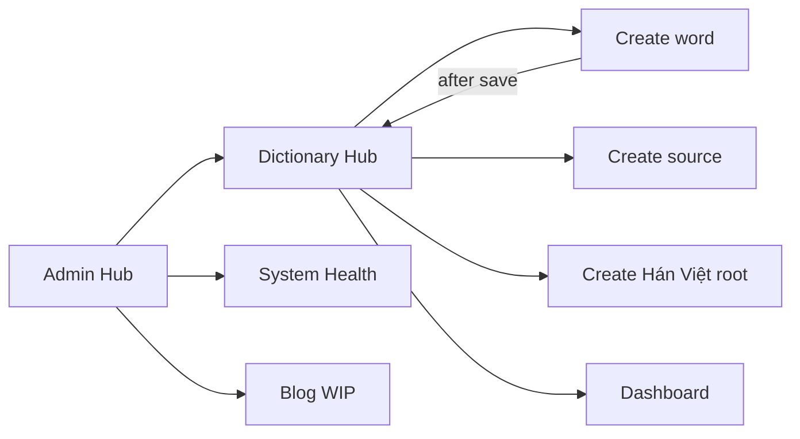

# v1.4.0 Admin UX polish, Hán Việt create, public dictionary ribbon

## Design locks

- **Back-button style:** New shared class `.admin-btn-back` — white/light fill, `1px` border using `--admin-dark-text` / slate (`#64748b`), text `--admin-dark-text`, hover fill `#e2e8f0` (slate-100). Differentiates from filled green `.admin-btn` without leaving the existing slate/green admin palette.
- **Back-button copy + icons (Bootstrap Icons already used on tiles):**
  - From Dictionary hub / Blog WIP / System Health → `Back to Admin Hub` with `bi-grid-1x2`
  - From create / edit / dashboard → `Back to Dictionary Hub` with `bi-book`
- **Admin home title:** `Admin Hub` (keep CSS class `admin-workspace` to avoid a large rename).
- **Trends mock:** In `development` / `testing`, `get_historical_metrics` returns a synthetic Chart.js series sized for the range when the DB series is empty (dev still skips snapshot persistence).
- **Post-create redirect:** Client navigates to `/admin/dictionary` (hub), not edit.
- **Recent ribbon:** SSR the 5 newest words by `created_at` on the public index (new repo method). No public AJAX API.
- **requirements.txt:** Rewrite as UTF-8 (fix UTF-16 regression); keep `psutil` alphabetically between `protobuf` and `pyasn1`; move `python-dateutil` next to `python-dotenv`.
- **Commit draft only:** [`temporary/commit-drafts/v1.4.0-admin-ux-polish.txt`](temporary/commit-drafts/v1.4.0-admin-ux-polish.txt) — do not commit.

---

## 1. System Health trends mock + range highlight

**Service** ([`app/services/system_health_service.py`](app/services/system_health_service.py)):
- After loading DB history, if `_uses_mock_metrics()` and series is empty, return `_mock_historical_metrics(range_key)` — deterministic-ish CPU/RAM (and swap/disk) points with timestamps matching each range’s bucket cadence (e.g. ~96 × 15m for `24h`, hourly for `7d`, etc.).
- Keep production/DB path unchanged when rows exist.

**UI** ([`app/static/js/systemHealth.js`](app/static/js/systemHealth.js), [`admin.css`](app/static/css/admin.css)):
- Confirm default `24h` button has `is-active`; on toggle, swap `is-active` (already present).
- Strengthen `.admin-range-toggles button.is-active` contrast (stronger fill/border) so the chosen range is obvious.

**Tests:** unit coverage that development/testing empty DB yields non-empty labels/cpu/ram for each range key.

---

## 2. Admin Hub rename + consistent back buttons

| Location | Change |
|---|---|
| [`admin/home.html`](app/templates/admin/home.html) | H1 → `Admin Hub` |
| [`dictionary_hub.html`](app/templates/admin/dictionary_hub.html), [`blog_wip.html`](app/templates/admin/blog_wip.html), [`system_health.html`](app/templates/admin/system_health.html) | Footer → `admin-btn-back` + icon + `Back to Admin Hub` |
| [`dictionary_create.html`](app/templates/admin/dictionary_create.html), [`dictionary_edit.html`](app/templates/admin/dictionary_edit.html), [`dictionary_dashboard.html`](app/templates/admin/dictionary_dashboard.html) | → `admin-btn-back` + `bi-book` + `Back to Dictionary Hub` |

Add `.admin-btn-back` / `:hover` in [`admin.css`](app/static/css/admin.css). Update route/assert tests that look for old copy (`Back to admin`, `Back to workspace`, `admin workspace`).

---

## 3. Searchable source picker on Examples

Reuse existing [`GET /admin/dictionary/sources?q=`](app/routes/dictionary.py) (already searches or lists recent).

In [`dictionary_create.html`](app/templates/admin/dictionary_create.html) / [`dictionary_edit.html`](app/templates/admin/dictionary_edit.html) + [`dictionaryAdmin.js`](app/static/js/dictionaryAdmin.js):
- Replace plain `<select id="example-source">` with a compact combobox: text search input + results list / select.
- On focus / empty query: show recent sources (current `data-recent-sources` / `list_recent`).
- On debounce (~250–300ms) typing: call `/admin/dictionary/sources?q=…` and refresh options.
- Selecting a row sets the active `sourceId` used by Add example (same payload path as today).

Keep the “Create a source entry” link.

---

## 4. Hán Việt check feedback + Create Hán Việt root tab

### Empty / no-match feedback ([`dictionaryAdmin.js`](app/static/js/dictionaryAdmin.js))
After `renderHanVietCheck`:
- Empty word / no syllables → message in `#han-viet-results`: e.g. `Enter a Vietnamese word to check.`
- Syllables checked but `found` and `missing` empty (edge) or only missing with no rows rendered → always show a summary line: `Checked N syllable(s): X found, Y missing.`
- When `missing` has items, keep create-root rows; when `found`/`missing` both empty after a real check, show `No Hán Việt roots matched …` so the UI never stays blank.

Update create-workspace helper copy to point at the new tab (not only “associate during edit”).

### Third create-workspace tab + hub tile
- Extend create tabs: `word` | `source` | `han-viet` in [`dictionary_create.html`](app/templates/admin/dictionary_create.html) and [`render_create_workspace`](app/controllers/dictionary_controller.py).
- New panel: root / Chinese character / meaning + Create button.
- Hub tile on [`dictionary_hub.html`](app/templates/admin/dictionary_hub.html): **Create Hán Việt root** (`bi-translate` or similar) → `tab=han-viet`.

### Backend (standalone create, no word association)
- Add `HanVietService.create_root(...)` (validation mirrored from `create_and_associate`, but no `associate`).
- Add `POST /admin/dictionary/han-viet` → controller returns created root JSON.
- Small JS module or extend [`dictionaryAdminSource.js`](app/static/js/dictionaryAdminSource.js) pattern as `dictionaryAdminHanViet.js` for the tab.

Later word create/check will find these roots via existing `check` / associate flow.

---

## 5. Redirect after word create

In [`dictionaryAdmin.js`](app/static/js/dictionaryAdmin.js) success path (~L435): change
`/admin/dictionary/${wordId}/edit` → `/admin/dictionary`.

Adjust any test that expects the edit redirect.

---

## 6. Move `create-admin` into `app/cli`

- Add [`app/cli/admin.py`](app/cli/admin.py) with `@click.command("create-admin")` (body moved from [`app/__init__.py`](app/__init__.py)).
- Register via `flask_app.cli.add_command(...)` next to `health_cli`.
- Remove the inline `@flask_app.cli.command` definition.

---

## 7. Fix `requirements.txt` encoding / order

Rewrite [`requirements.txt`](requirements.txt) as UTF-8 text (not UTF-16). Keep `psutil==7.2.2` between `protobuf` and `pyasn1`. Relocate `python-dateutil` beside `python-dotenv`.

---

## 8. Public dictionary hero + Recently added ribbon

### Hero ([`dictionary/index.html`](app/templates/dictionary/index.html), [`dictionary.css`](app/static/css/dictionary.css))
Exact compact copy:

1. `Growing organically alongside my language journey with words and phrases encountered in daily life.`
2. Centered divider: `🇻🇳` (styled `.dictionary-intro-flag`)
3. `Example sentences reflect real-world encounters rather than artificial textbook exercises.`

Keep existing admin-aligned gradient card weight.

### Recently added ribbon
- Repo: `WordRepository.list_recently_created(limit=5)` ordered by `created_at.desc()`.
- Public index controller/route passes `recent_words` into the template (SSR).
- Markup directly under the search input:
  `Recently added: term1 • term2 • …` with each term linking to `url_for('dictionary.word_detail', …)` (same public detail route already used by search results).
- Compact, wrapping-friendly CSS for mobile.

**Tests:** public `/dictionary` contains flag + ribbon terms when seeded; empty DB shows no broken ribbon (hide or show empty muted state — prefer hide when zero).

---

## 9. Changelog + commit draft

Extend [`CHANGELOG.md`](CHANGELOG.md) `[1.4.0]` Added/Changed with user-visible bullets (Admin Hub, back buttons, trends mock, source search, Hán Việt create tab, create redirect, public hero/ribbon, CLI move, requirements fix).

New draft: `temporary/commit-drafts/v1.4.0-admin-ux-polish.txt`.

---

## Ordered implementation

1. requirements.txt UTF-8 fix + move create-admin CLI  
2. Admin Hub rename + `.admin-btn-back` + all back links  
3. System Health mock history + range toggle emphasis  
4. Source combobox on create/edit examples  
5. Hán Việt empty-state feedback + standalone create service/route/tab/hub tile  
6. Post-create redirect to Dictionary hub  
7. Public hero copy + recent ribbon (repo + SSR)  
8. Tests + changelog + commit draft  
9. Targeted pytest via `.venv`
