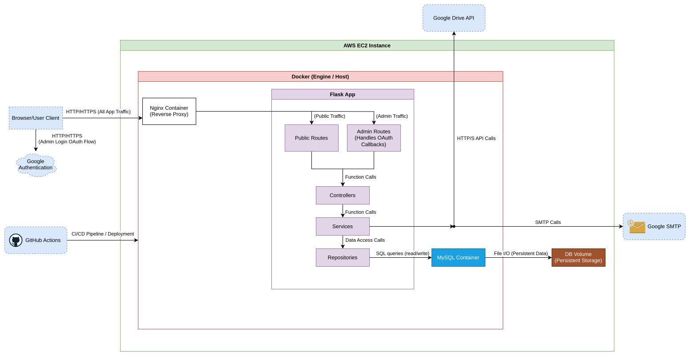

# Personal Website & Blog – [damianpiatkowski.com](https://damianpiatkowski.com)

A Flask-powered personal website with a blog component, live at [damianpiatkowski.com](https://damianpiatkowski.com). It features a custom-built blog engine that syncs content from Google Drive, sanitizes it, and stores it in a MySQL database. The site also includes a resume, an about page, and an admin interface for managing posts. The entire project is containerized with Docker for easy deployment and local development.

This project is public not just as a portfolio piece, but also to serve as a learning resource for others interested in building a personal website or Flask-based app with CI/CD, Google Drive API integration, and MySQL-backed content management.

***

**For detailed information on project diagrams, refer to [Draw.io Diagramming Guide](docs/DRAWIO_GUIDE.md).**

---

## Table of Contents

* [Features](#features)
* [Architecture Overview](#architecture-overview)
    * [Layered Architecture](#layered-architecture)
    * [High-level Architecture Diagram](#high-level-architecture-diagram)
    * [Diagram Explanation](#diagram-explanation)
* [Technology Stack](#technology-stack)
* [Containerization Setup](#containerization-setup)
    * [Docker Installation & Setup](#docker-installation--setup)
        * [Linux](#linux)
        * [Windows](#windows)
    * [Running the Docker Containers](#running-the-docker-containers)
* [Deployment](#deployment)
    * [Strategy](#strategy)
    * [CI/CD (GitHub Actions)](#cicd-github-actions)
* [License](#license)

---

## Features

* 📄 Blog with paginated posts and individual article pages
* ✍️ Admin interface with AJAX-powered upload and delete operations
* 📂 Google Drive API integration to sync blog drafts
* 🧼 Content normalization and sanitization before database insertion
* 📁 Static pages: About Me, Resume, and Privacy Policy
* 📬 Contact form with backend processing and flash messaging
* 🐋 Dockerized setup with GitHub Actions for CI/CD deployment
* 🐬 File-based MySQL database for blog post storage

---

## Architecture Overview

This project is a personal website and blog engine powered by Flask, deployed with Docker on an EC2 instance, and uses GitHub Actions for CI/CD. Blog content is sourced from Google Drive and persisted into a file-based MySQL database.

***

### Layered Architecture

The Flask application follows a layered architecture inspired by the book *Architecture Patterns with Python: Enabling Test-Driven Development, Domain-Driven Design, and Event-Driven Microservices* by Bob Gregory and Harry Percival. This approach promotes clear separation of concerns, making the system easier to test, maintain, and extend.

```
Flask App
├── Routes
│   └── Handles incoming HTTP requests and maps them to controllers
├── Controllers
│   └── Orchestrate request handling, call services
├── Services
│   └── Contain business logic, call repositories or external APIs (e.g. Google Drive)
├── Repositories
│   └── Interact with the MySQL database using SQLAlchemy
```

***

### High-level Architecture Diagram

A visual overview of the system's high-level architecture is provided below. This diagram offers a clear, scalable representation of the application's components and their interactions, designed to be easily viewable across all platforms.



---

### Diagram Explanation

This diagram illustrates the main components and data flows within the system:

* **User Interaction**: The **Browser/User Client** initiates all requests. Standard website traffic routes through **Nginx** to the **Public Routes** in the Flask app. Access to the administrative panel also goes via Nginx, but specifically targets the **Admin Routes**.
* **Authentication**: The **Admin Routes** are uniquely responsible for handling the **Google OAuth flow**, connecting with **Google Authentication** to verify your identity. Public routes don't require any authentication.
* **Internal Flask Flow**: Both **Public Routes** and **Admin Routes** delegate logic to **Controllers**, which then orchestrate requests by interacting with **Services**. Services encapsulate the core business logic.
* **Data Persistence**: **Services** communicate with **Repositories** for all data access operations. The Repositories then interact with the **MySQL Container** by sending SQL queries.
* **Persistent Storage**: The **MySQL Container** stores its data persistently on a dedicated **DB Volume** (a file-based volume on the EC2 instance).
* **External APIs**: **Services** also manage interactions with external APIs, such as the **Google Drive API** (for fetching blog content) and an **SMTP Server** (e.g., Gmail) for sending emails.
* **Deployment & CI/CD**: **GitHub Actions** handles the continuous integration and deployment process, securely pushing updates to the **AWS EC2 Instance**.

---

## Technology Stack

* **Python / Flask** – Main backend framework
* **Jinja2** – Template rendering
* **MySQL (File-based)** – Lightweight DB for storing blog posts
* **Google Drive API** – Blog post draft source
* **Docker / Docker Compose** – Container orchestration
* **GitHub Actions** – CI/CD
* **EC2** – Deployment host

---

## Containerization Setup

This project leverages Docker for containerization, which offers significant benefits for both development and deployment.

**What is Docker?** Docker is a platform that allows you to automate the deployment, scaling, and management of applications using containers. Containers are lightweight, standalone, executable packages of software that include everything needed to run an application: code, runtime, system tools, system libraries, and settings.

**Why use Docker?**
* **Environment Consistency:** Ensures that the development, testing, and production environments are identical, eliminating "it works on my machine" issues.
* **Isolation:** Applications and their dependencies are isolated from each other and from the host system, preventing conflicts.
* **Easy Setup:** Simplifies the process of setting up a development environment, as all dependencies are pre-packaged.
* **Portability:** Containers can run consistently across different operating systems and cloud providers.

***

### Docker Installation & Setup

Before running the project, ensure Docker Desktop (for Windows/macOS) or Docker Engine (for Linux) is installed and running on your machine.

***

#### Linux

If you're on a Linux system, Docker runs as a service. You'll need `sudo` privileges to manage it.

1.  **Check Docker Status:**
    First, verify if the Docker daemon is running:
    ```bash
    sudo systemctl status docker
    ```
    You should see `Active: active (running)`. If it's not running, or if you get an error, proceed to the next step.

2.  **Start Docker (if needed):**
    If Docker is not running, start the service:
    ```bash
    sudo systemctl start docker
    ```

3.  **Enable Docker on Boot (Recommended):**
    To ensure Docker starts automatically every time your system boots, enable the service:
    ```bash
    sudo systemctl enable docker
    ```

***

#### Windows

*(This section is a placeholder. Add detailed steps for installing Docker Desktop on Windows here, including enabling WSL2 if necessary, and ensuring it's running.)*

---

### Running the Docker Containers

Once Docker is installed and running, you can start the project's services (your Flask application and MySQL database) using Docker Compose.

1.  **Prepare your Environment File:**
    Ensure you have a `.env` file in the same directory as your `docker-compose.yml` file. This file will contain crucial environment variables for your database and application. An example `.env` file looks like this:
    ```
    # === General ===
    FLASK_ENV=development
    # Flask secret key for sessions and CSRF
    SECRET_KEY=example
    
    # === Admin Panel Google OAuth (frontend-based OAuth login for the admin panel) ===
    ADMIN_PANEL_ALLOWED_USERS=example
    ADMIN_PANEL_GOOGLE_CLIENT_ID=example
    ADMIN_PANEL_GOOGLE_CLIENT_SECRET=example
    ADMIN_PANEL_GOOGLE_REDIRECT_URI=http://localhost:5000/login/authorized
    
    # === Google Drive API ===
    DRIVE_BLOG_POSTS_FOLDER_ID=example
    DRIVE_BLOG_POSTS_FOLDER_ID_TEST=example
    ```
    *Replace the placeholder values with your desired credentials.*

2.  **Navigate to the Project Directory:**
    Open your terminal or command prompt and navigate to the root directory of this project, where the `docker-compose.yml` file is located.

    ```bash
    cd /path/to/your/flask_project
    ```
    *(Replace `/path/to/your/flask_project` with the actual path to your project.)*

3.  **Start the Containers:**
    Execute the following command to build (if necessary) and start all services defined in your `docker-compose.yml` file in detached mode (meaning they will run in the background).

    ```bash
    docker compose up -d
    ```

    **Explanation of the command:**
    * `docker compose`: This is the main command for interacting with Docker Compose projects.
    * `up`: This subcommand builds, (re)creates, starts, and attaches to containers for a service.
    * `-d`: This flag stands for "detached mode." It starts the containers in the background, allowing you to continue using your terminal. If you omit `-d`, the logs from your containers will be displayed in your terminal, and you'll need to press `Ctrl+C` to stop them (which will also stop the containers).

4.  **Verify Running Containers:**
    To confirm that your containers are running correctly, you can use the `docker ps` command:

    ```bash
    docker ps
    ```
    You should see output listing containers for your `web` (Flask app) and `db` (MySQL) services, with a `Status` of `Up`.

5.  **Access Your Application:**
    Once the containers are up and running, your Flask application should be accessible in your web browser at:

    `http://localhost:5000`

    *(Note: If you changed `FLASK_RUN_PORT` in your `.env` file, use that port instead of 5000.)*

---

## Deployment

### Strategy

* **Dual-Stage Deploy**: `staging` & `production`
* **Deployed to EC2 via GitHub Actions**
* Secrets (e.g., SSH keys, ENV variables) stored in GitHub Secrets

### CI/CD (GitHub Actions)

* On push to `main` or PR merge, actions will:

  * Build and test the container
  * SSH into EC2
  * Pull the latest image
  * Restart the containers

---

## License

This project is open-sourced under the [MIT License](LICENSE) © Damian Piatkowski.
