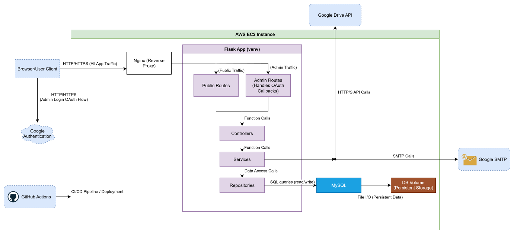

# Personal Website & Blog – [damianpiatkowski.com](https://damianpiatkowski.com)

A Flask-powered personal website with a blog component, live at [damianpiatkowski.com](https://damianpiatkowski.com). It features a custom-built blog engine that syncs content from Google Drive, sanitizes it, and stores it in a MySQL database. The site also includes a resume, an about page, and an admin interface for managing posts.

This project is public not just as a portfolio piece, but also to serve as a learning resource for others interested in building a personal website or Flask-based app with CI/CD, Google Drive API integration, and MySQL-backed content management.

---

**For database setup and management details, refer to [Database Management Guide](docs/database-guide.md).**
**For detailed information on project diagrams, refer to [Draw.io Diagramming Guide](docs/drawio-guide.md).**

---

## Table of Contents

* [Features](#features)
* [Architecture Overview](#architecture-overview)

  * [Layered Architecture](#layered-architecture)
  * [High-level Architecture Diagram](#high-level-architecture-diagram)
  * [Diagram Explanation](#diagram-explanation)
* [Technology Stack](#technology-stack)
* [Local Setup (with venv)](#local-setup-with-venv)
* [Deployment](#deployment)

  * [Deployment Workflow](#deployment-workflow)
  * [CI/CD (GitHub Actions)](#cicd-github-actions)
* [License](#license)

---

## Features

* 📄 Blog with paginated posts and individual article pages
*✍️ Admin interface with AJAX-powered upload and delete operations
* 📂 Google Drive API integration to sync blog drafts
* 🧼 Content normalization and sanitization before database insertion
* 📁 Static pages: About Me, Resume, and Privacy Policy
* 📬 Contact form with backend processing and flash messaging
* 🚀 Deployed on AWS EC2 with GitHub Actions for CI/CD
* 🐬 MySQL database for blog post storage

---

## Architecture Overview

This project is a personal website and blog engine powered by Flask, deployed on a naked EC2 instance using a Python virtual environment (`venv`) and `systemd` for process management. GitHub Actions is used for CI/CD. Blog content is sourced from Google Drive and persisted into a MySQL database.

---

### Layered Architecture

```
Flask App
├── Routes
│   └── Handles incoming HTTP requests and maps them to controllers
├── Controllers
│   └── Orchestrate request handling, call services
├── Services
│   └── Contain business logic, call repositories or external APIs (e.g. Google Drive)
├── Repositories
│   └── Interact with the MySQL database using SQLAlchemy
```

---

### High-level Architecture Diagram



---

### Diagram Explanation

* **User Interaction**: Requests from browsers are routed through **Nginx** to the **Flask app**. Admin routes require authentication via Google OAuth.
* **Authentication**: Admin routes handle the **Google OAuth flow** using Google APIs.
* **Internal Flask Flow**: Routes delegate logic to **Controllers**, which interact with **Services**.
* **Data Persistence**: **Services** talk to **Repositories**, which interact with **MySQL**.
* **Persistent Storage**: MySQL data is stored on disk on the EC2 instance.
* **External APIs**: The system integrates with **Google Drive API** (for blog posts) and an **SMTP server** (e.g., Gmail) for sending emails.
* **Deployment & CI/CD**: GitHub Actions builds, tests, and deploys directly onto the **EC2 instance**.

---

## Technology Stack

* **Python / Flask** – Main backend framework
* **Jinja2** – Template rendering
* **MySQL** – Database for storing blog posts
* **Google Drive API** – Blog post draft source
* **GitHub Actions** – CI/CD
* **Nginx + Gunicorn** – Reverse proxy & WSGI server
* **EC2** – Deployment host

---

## Local Setup (with venv)

1. Install system dependencies:

   ```bash
   sudo apt update
   sudo apt install python3 python3-venv python3-pip mysql-server
   ```

2. Clone the repository into `/srv/portfolio/`:

   ```bash
   cd /srv/portfolio
   git clone https://github.com/damian-j-piatkowski/damianpiatkowski.com.git
   cd damianpiatkowski.com
   ```

3. Create a virtual environment **outside the repo** (at `/srv/portfolio/venv`) and activate it:

   ```bash
   cd /srv/portfolio
   python3 -m venv venv
   source venv/bin/activate
   ```

4. Install dependencies from the repo:

   ```bash
   cd damianpiatkowski.com
   pip install --upgrade pip
   pip install -r requirements.txt
   ```

5. Configure environment variables in a `.env` file inside the repo:

   ```
   /srv/portfolio/damianpiatkowski.com/.env
   ```

6. Run the application:

   ```bash
   flask run
   ```

   Visit [http://localhost:5000](http://localhost:5000).

---

## Deployment

### Deployment Workflow

On the EC2 instance, the deployment process is handled manually (and via GitHub Actions) using the `portfolio` user and `systemd` service:

```bash
# switch to portfolio user
sudo -i -u portfolio

cd /srv/portfolio/damianpiatkowski.com

# get the latest code and tags
git fetch --tags
git checkout v1.0.2

# remove old virtualenv and recreate it from scratch
rm -rf venv
python3 -m venv venv
source venv/bin/activate

# upgrade pip and reinstall all dependencies cleanly
pip install --upgrade pip
pip install -r requirements.txt

deactivate
exit

# restart service to pick up new code + fresh deps
sudo systemctl restart portfolio.service

# tail logs to confirm startup
sudo journalctl -u portfolio.service -f
```

The `portfolio.service` unit file runs the app with Gunicorn and is managed by `systemd`.

---

### CI/CD (GitHub Actions)

On push to `main` or PR merge, GitHub Actions can:

* Run tests
* SSH into EC2
* Fetch the latest code & tags
* Rebuild the venv
* Restart the `portfolio.service`

---

## License

This project is open-sourced and distributed under the terms of the **[MIT License](LICENSE)**.

Copyright © 2024–Present Damian Piatkowski.